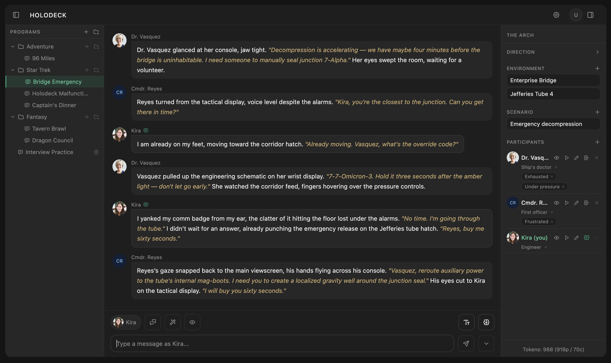
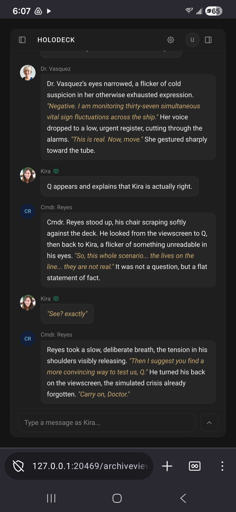

# Holodeck

A local browser-based interactive fiction engine for simulating multi-character scenes, where each AI character operates from its own filtered context and subjective view of the cast. Depends on running your own llama.cpp server.



## Features

Each character makes its own LLM call against a filtered transcript; characters only see what they should know, giving each one a genuinely subjective view of events.

- **Local and offline**: runs entirely in your browser against your own llama.cpp server, no cloud required
- **localStorage**: all data is stored in your browser's local storage — no server, no account
- **Programs**: named scenes with participants, environments, and scenarios; AI generation from a premise
- **Presence toggling**: characters enter and leave the scene; their context is filtered from future prompts
- **Generation variants**: regenerate or edit any message and navigate between versions
- **Fork**: branch the scene at any message into an independent copy
- **Auto-play**: AI picks who speaks next, or every present character takes a turn
- **Choose your own adventure**: three parallel response options to pick from
- **Per-program prompt control**: system prompt, closing instruction, and content policy per scene
- **Mobile-friendly layout**: designed to work on phones

## Disclaimer

This repository was built as an exercise in AI-assisted coding.

## Model

Designed for use with [Mistral-Small-23B-Instruct-2501](https://huggingface.co/mistralai/Mistral-Small-24B-Instruct-2501) via a local server (OpenAI-compatible API).

Any OpenAI-compatible endpoint works. Base URL, model name, and API token are all configurable at runtime.

## Setup

### Download the model

```bash
curl -L -o Mistral-Small-24B-Instruct-2501-Q8_0.gguf \
  "https://huggingface.co/bartowski/Mistral-Small-24B-Instruct-2501-GGUF/resolve/main/Mistral-Small-24B-Instruct-2501-Q8_0.gguf"
```

### Start model with llama-server

Download a pre-built release from the [llama.cpp releases page](https://github.com/ggml-org/llama.cpp/releases).

For Windows with an NVIDIA GPU, download both of these from the same release and extract them into the same folder:

- `llama-b9351-bin-win-cuda-13.1-x64.zip` = the server binary
- `cudart-llama-bin-win-cuda-13.1-x64.zip` = the CUDA runtime DLLs (required for GPU support)

The CUDA runtime DLLs must be in the same directory as the executable. You can verify GPU detection with:

```
llama-server.exe --list-devices
```

Run `llama-server.exe` from the extracted directory:

```bash
./llama-server.exe \
  --model Mistral-Small-24B-Instruct-2501-Q8_0.gguf \
  --host 127.0.0.1 \
  --port 8081 \
  --ctx-size 32768 \
  --n-gpu-layers 99 \
  --api-key my-secret-token
```

| Flag | Description |
|------|-------------|
| `--ctx-size 32768` | Context window (32k, matches model max) |
| `--n-gpu-layers 99` | Offload all layers to GPU; set to `0` for CPU-only |
| `--api-key` | Bearer token required on all requests |
| `--parallel` | Number of simultaneous request slots (default: 1) |

### Access the UI

Open `holodeck.html` directly in a web browser. API settings can be entered in the settings panel without a config file.

Add `?session=name` to the URL to use an independent data store (e.g. `holodeck.html?session=work`). Useful for running multiple separate sessions in the same browser.

Add `?censor=false` to disable the content filter and unlock editing of the content policy prompt.

Both can be combined:

```
holodeck.html?session=private&censor=false
```

## Mobile



### Android setup

1. Download the repository as a ZIP from GitHub (Code → Download ZIP)
2. Open the ZIP in [Cx File Explorer](https://play.google.com/store/apps/details?id=com.cxinventor.file.explorer)
3. Tap `holodeck.html` and open it with a browser — Cx File Explorer starts a local web server automatically, which allows the page to function correctly

Configure the API settings in the settings panel once the page loads.

---

## Troubleshooting

**Out of memory:** Reduce `--ctx-size` (try `8192`) or lower `--n-gpu-layers` to partially offload.

**Slow responses:** Mistral-Small-24B is ~14 GB. On CPU it generates ~1–3 tokens/sec. A GPU with 16+ GB VRAM runs at full speed.

## License

Licensed under either of [MIT](LICENSE-MIT) or [Apache 2.0](LICENSE-APACHE) at your option.

